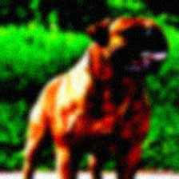
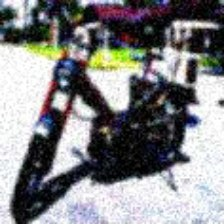
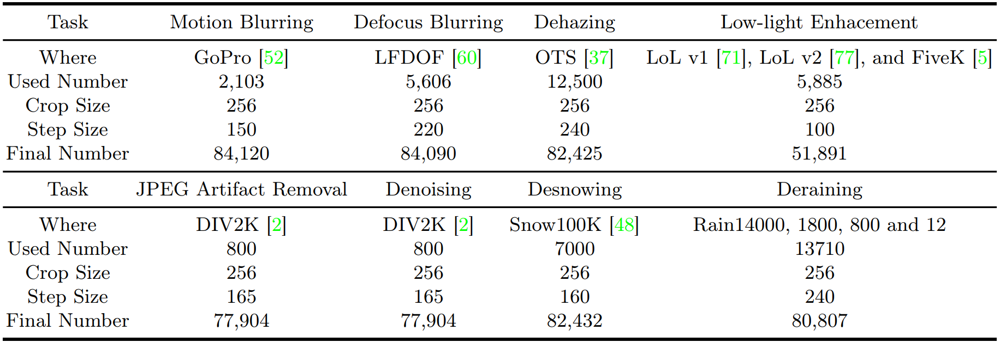

# ConStyle v2: A Strong Prompter for All-in-One Image Restoration      

[Dongqi Fan](https://scholar.google.com.hk/citations?user=P7gt5XYAAAAJ&hl=zh-CN), Junhao Zhang,  [Liang Chang](https://scholar.google.com.hk/citations?hl=zh-CN&user=5pWnfJcAAAAJ)

## Visual examples

A few visual examples of training data in the pre-training stage:

## Mix Degradations datasets

The Mix Degradations datasets  and the uncropped joint datasets are avaliable at: https://pan.baidu.com/s/1hk7re1JEBQHVpzta1WhWgA?pwd=5dz9 
Code：5dz9

Mix Degradations datasets are placed in the [All] folder and can be directly used for training. If needed, users must download DIV2K datasets and use gen_degradations.py to generate noise and JPEG datasets.

## Weight files

All weight files can be found at: https://pan.baidu.com/s/1GYdERj8-hOL3hmywaveMgQ?pwd=hs32  CODE：hs32

[pretrained_ConStyle_v2.pth] can be directly used to improve the performance of Image Restoration models, single or all-in-one, without any fine-tuning.

## Environment

python=3.8,  pytorch=1.11

Users need to install Wand in your environment for training:https://docs.wand-py.org/en/latest/guide/install.html

## How to use

The detail of datasets preparation, training and testing please refer to the docs in [BasicSR.](https://github.com/xinntao/BasicSR)

**Training:** 

uncomment the code in data/image_datasets.py for training, lines 22-23, and lines 727-783. 

(single)  python train.py -opt options/Single/[Maxim, NAFNet, or Restormer]/train/[Deblur, Denoise, or Dehaze].yml

(all-in-one)  python train.py -opt options/All-in-One/train/[ConStylev2, train_ConStylev2Model, train_OriginModel].yml

**Testing:**

(single)  python test.py -opt options/Single/[Maxim, NAFNet, or Restormer]/test/[Deblur, Denoise, or Dehaze].yml

(all-in-one)  python test.py -opt options/All-in-One/test/[*].yml

**Note:**

**"IRConStyle" model:**  ConStyle v2 and original model, eg. ConStyle v2+ NAFNet. Where ConStyle v2 is frozen during training.

**"ConStyle" model:** ConStyle and original model, eg. ConStyle+ NAFNet, will jointly train from scratch, same as [IRConStyle](https://github.com/Dongqi-Fan/IRConStyle). 

**"ConStyle_v2" model:** Pre-train the ConStyle v2 model alone.

**"Origin" model:** Train the original model alone,  without ConStyle or ConStyle v2.

## **Acknowledgment** 

This project is based on the [BasicSR](https://github.com/xinntao/BasicSR).  The synthesis degradation process in pre-training stage is based on [Benchmarking Neural Network Robustness to Common Corruptions and Perturbations](https://github.com/hendrycks/robustness) and [Real-ESRGAN: Training Real-World Blind Super-Resolution with Pure Synthetic Data](https://openaccess.thecvf.com/content/ICCV2021W/AIM/papers/Wang_Real-ESRGAN_Training_Real-World_Blind_Super-Resolution_With_Pure_Synthetic_Data_ICCVW_2021_paper.pdf). Thanks for their excellent work!

## Contact

If you have any questions, please contact dongqifan@std.uestc.edu.cn.

## Citation

If you find our idea and code helpful, please cite our work.

